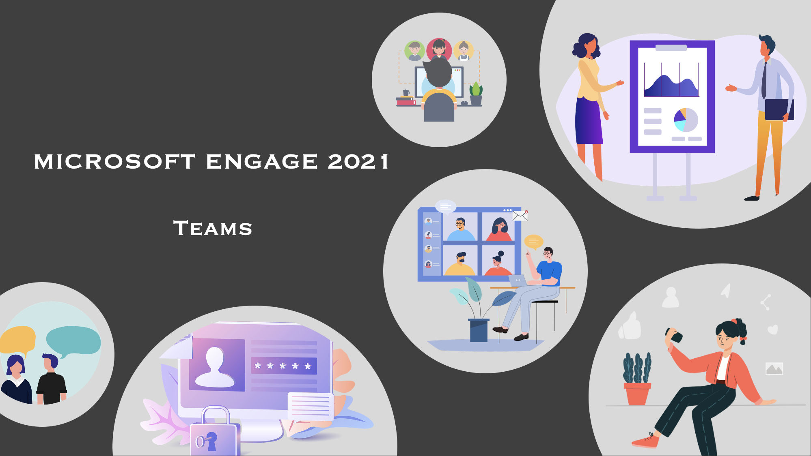

# [Microsoft-Engage TeamClone!️](https://bit.ly/3hkQhmV )

### A Video-Chat android application.
-----------------------------------------------------------------------------------------------------------------------------------------------------------------------
# Introduction
A Video-Chat android application which makes use of the Jitsi for video calling and Cloud Firestore for other functionalities!  

# Features 
> :heavy_check_mark: **Authentication**\
> :heavy_check_mark: **Real-time video call using Jitsi**\
> :heavy_check_mark: **Screen sharing**\
> :heavy_check_mark: **Join an existing group or create your own group to communicate with everyone**\
> :heavy_check_mark: **One-to-one conversation**\
> :heavy_check_mark: **Share moments**\
> :heavy_check_mark: **Push notification when you receive a new message**\
> :heavy_check_mark: **Calendar**\
> :heavy_check_mark: **Notes**\
> :heavy_check_mark: **Responsive layout**\

# Tech Stack:
> **Android app**- Flutter  
> **Firebase notification server**- NodeJS  
> **Jitsi SDK**- React-Native

# Features Description :

### Authentication
- Email-Phone authentication with secure OTP verication.
- Google login

### Video calling
- Allows more than 100 users to connect at the same time.
- Live chat available during call.
- Screen sharing.
- Video call's admin posseses powers like <b>Disable Everyones Camera</b>, <b>Mute Everyone</b>

### Synchronized video call chat with group chats
- Chats that happen during the video call are simultaneously saved in a group consisting of all the video call members
- Users can create chat groups from which they can seamlessly do video calls
### Chat  
- User can have a one-to one chat with anyone.
- Create group and connect with everyone
- Image sharing and video call option.

### Calendar
- Keep your schedule handy with yourself.
- Receive timely notification for scheduled tasks

### Notes
- Save important information discussed in your meetings as notes

### Setting
- Change the theme of the app(Light and Dark Mode).
- Seamlessly update the profile details like name and profile pictures.

# Screenshots 

### Video call

  
   

### Light Mode

  
   
  

### Dark Mode

  
   
  

# Jitsi SDK used in this project

Followed the steps provided on [Jitsi website](https://jitsi.github.io/handbook/docs/dev-guide/dev-guide-android-sdk) to build Jitsi SDK according to my requirements.

- User interface changes.
- Added only those functionalities that were required.
- Video call message sync with chat.
